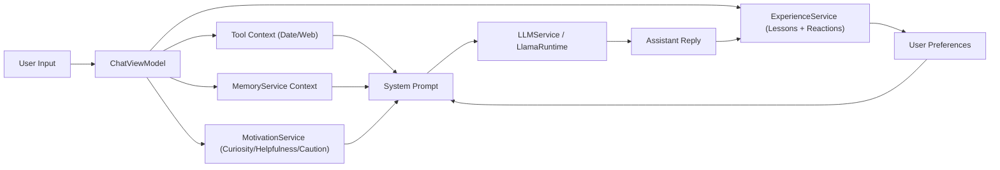

# VALIS

VALIS is an offline, on-device AI chat application for iOS, built with Swift and `llama.cpp`. It features a unique "plastic" brain architecture with dynamic memory and agentic capabilities.

## Features

- **Fully Offline**: Runs entirely on-device using GGUF models via `llama.cpp`.
- **Plastic Brain**: A cognitive architecture where memories have emotions, importance, activation, and associative links.
- **Agentic Orchestration**: Uses tools (Web Search, System Date) based on intent.
- **Autonomous Memory (Optional Network)**: Background “spontaneous” steps can trigger self-driven knowledge consolidation (e.g. Wikipedia + DuckDuckGo snippets) and periodic pruning.
- **Thinking UI**: Visualizes the model's "chain of thought" (parsing `<think>` tags).
- **Experience Layer**: Captures user/assistant exchanges as “experience + reflection” and feeds lessons back into context.
- **Motivators & Preferences**: Dynamic motivators (curiosity/helpfulness/caution) and user preference learning via like/dislike.
- **Privacy First**: All data and inference stay on your device.

## Architecture Overview

VALIS is built using SwiftUI and follows a MVVM architecture with a lightweight service layer that keeps inference on-device while orchestrating memory, tools, and emotional tone.

### Memory & Emotion Architecture
`MemoryService` is the heart of the “plastic brain.” Each `Memory` encodes content, an emotion tag, importance, normalized embeddings, associative links, and **prediction signals** (score + error). The `MemoryGraph` keeps concept/emotion nodes connected, while the `CognitiveEchoGraph` tracks activation, decay, and spontaneous boosts so charged nodes can publish `memoryTriggered`. Background loops perform echo decay, spontaneous activation, autonomous consolidation from Wikipedia/DuckDuckGo summaries, and retention pruning. Identity continuity is anchored by **Identity Nodes** (core/beliefs/self) that never decay.
When the assistant needs context, `getContextBlock()` compresses the top-ranked memories, reports the emotional distribution (dominant tone + percentages), shows the latest prediction signal, adds a soft empathy reminder, and, within a **profile-based budget**, appends the freshest raw memories so the model can “remember what just happened.”

The echo-graph is treated as a living memory organ: it lets the app be both questioner and answerer, while pinned Identity Nodes (zero decay) act as a core that never forgets. Prediction signals allow each memory to self-rate its value so the system can decide when to grow or prune. A few extensions that keep the system humming without bloating the prompt:
- **Decay buffer**: add a soft decay curve for non-core nodes based on last-use time, so pruning can be probabilistic rather than a hard cut.
- **Feedback loop**: have the Agentic Orchestration layer rate fetched snippets (confidence + relevance) and feed that back into the memory score, so the system learns which external content actually boosts performance.
- **Context gate**: throttle Fucontext flow into the live chat when activation falls below a threshold, preventing low-signal noise from drowning the conversation.

### Core Components
- **LLMService**: Wraps `llama.cpp` for token generation, response scoring, and cognitive filtering.
  - Manages the `LlamaRuntime` instance and short-term generation cache.
  - Injects the context block (compressed/emotional/raw) into the system prompt and scores sentences for “cognitive relevance” before committing them back to memory.
- **MemoryService**: Builds the context block described above and keeps the echo/memory graphs in sync with persistence files in the documents directory.
- **ChatViewModel**: Orchestrates requests.
  - Applies reinforcement from user tone, decides whether to fire the Date or DuckDuckGo/Web search tools, aggregates tool context, and streams `<think>` tokens for the thinking UI.
  - Allows the assistant to request tools by writing `TOOL: ...` inside `<think>` and reruns generation after a tool response arrives.
- **ExperienceService**: Stores “experience” records (user text, assistant text, outcome, reflection, reaction) in `experiences.json` and returns a lessons block for the system prompt.
- **MotivationService**: Maintains the dynamic motivator state (curiosity/helpfulness/caution) and injects a guidance block into the system prompt.

### Tooling & Identity
- **IdentityService** populates the system prompt with the current persona, emphasizes that VALIS is “not a tool,” and teaches the model how to request `web_search` or `date` via `TOOL:` lines.
- **Tools**: `ChatViewModel` will call DuckDuckGo for fact-checking queries, add the system date when needed, and relay autonomous snippets from `WikipediaSource` / `DuckDuckGoSource` when a memory node glows.

### Stability Profiles
VALIS adapts to device capability. A **memory profile** tunes context budgets and loop timing:
- **Eco**: smaller memory budgets, slower echo/spontaneous loops.
- **Beast**: balanced defaults for modern phones.
- **Godmode**: larger budgets and faster loops for iPad/Mac or simulator.
See [structure.md](structure.md) for a detailed breakdown of the project files.

## Repository Layout

- **ZephyrAI/**: SwiftUI app target, including all chat UI, orchestration, memory, and runtime code.
- **Frameworks/**: Vendored binary frameworks such as `llama.xcframework` used for on-device GGUF inference.
- **AnyLanguageModel/**: Upstream Swift package checked in as a subfolder. Not used by the current VALIS target, but shows how to build a provider‑agnostic LLM layer that can talk to Apple’s Foundation Models, Core ML, MLX, llama.cpp, and remote HTTP APIs.
- **mlx-swift/**: Upstream MLX Swift repository vendored for experimentation and potential future backends. The shipping VALIS iOS app currently talks directly to `llama.xcframework` instead of MLX.

## Requirements

- **Xcode 15+** (iOS 17+ target)
- **llama.xcframework**: Must be placed in the `Frameworks/` directory.
- **GGUF Model**: A compatible GGUF model file (e.g., `LFM2.5-1.2B-Thinking-Q8_0.gguf`) bundled in the app.

## Quick Start

1. **Clone the repository**.
2. **Setup Frameworks**:
   - Ensure `Frameworks/llama.xcframework` is present.
3. **Add a Model**:
   - Download a GGUF model (e.g., Llama 3 8B Quantized).
   - Place it in `ZephyrAI/Resources/Models/`.
   - **Important**: Update the `modelFilename` in `ZephyrAI/Services/LLMService.swift` to match your file name.
4. **Build and Run**:
   - Open `ZephyrAI.xcodeproj`.
   - Ensure the model file is added to the "Copy Bundle Resources" build phase.
   - Run on a physical device (recommended for performance) or simulator.

## Usage

- **Chat**: Type your message to interact with the AI.
- **Tools**:
  - Ask "What is the date?" to trigger the Date tool.
  - Ask "Search for [topic]" to trigger the Web Search tool (requires internet connection for the search part, but inference remains local).
- **Like/Dislike**: Long‑press an assistant message to rate it; preferences are learned over time.
- **Autonomous Memory**:
  - When enabled, the app can periodically perform background “spontaneous” memory steps and (optionally) fetch short external snippets for consolidation.
  - Network is only used for fetching summaries; model inference remains local.
- **Memories**: Access the Memory view to see the internal state of the "Plastic Brain".

## Troubleshooting

- **`llama.h` not found**: Ensure `Frameworks/llama.xcframework` exists and is referenced correctly in the project settings.
- **`dyld: Library not loaded`**: Make sure `llama.xcframework` is set to "Embed & Sign" in the target's General settings.
- **Model loading error**: Verify the filename in `LLMService.swift` matches the file in `Resources/Models/` and that the file is included in the app bundle.
- **`Decode failed with code 1`**: This usually indicates a decode failure inside `llama.cpp` (often caused by context/batch limits). The runtime batches prompt decoding and trims overly-long prompts, but you may still need to:
  - lower `contextSize` in `LLMService.swift` for older devices, or
  - reduce external/tool context, or
  - try a smaller GGUF.

## License

[TBD]

## Model Download

The default model used by this project is not committed to the repository because it is larger than GitHub's file size limits. Download it from:

- [LiquidAI/LFM2.5-1.2B-Thinking](https://huggingface.co/LiquidAI/LFM2.5-1.2B-Thinking)

Place the GGUF file in `ZephyrAI/Resources/Models/` and update `modelFilename` in `ZephyrAI/Services/LLMService.swift` to match the filename.

## Frameworks

`Frameworks/` is not committed to Git because it contains large binary artifacts. Place `llama.xcframework` in `Frameworks/` before building.
