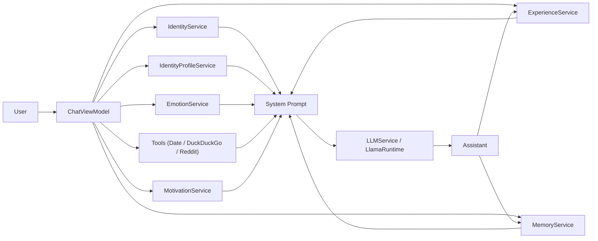

# VALIS

VALIS is an on-device AI chat app for iOS built with SwiftUI and `llama.cpp` (GGUF). It pairs local inference with a “plastic brain” memory system, experience-driven adaptation, lightweight tool use, and a glassy UI layer.

## Features

- **Fully Offline**: Runs entirely on-device using GGUF models via `llama.cpp`.
- **Plastic Brain**: Memories have emotion tags, importance, embeddings, associative links, and activation/decay.
- **Thinking UI**: Streams model output and parses `<think>...</think>` to show a separate thinking panel.
- **Tools (optional network)**:
  - Rule-based tool injection (Date, DuckDuckGo summaries, Reddit /r/news feed).
  - Model-initiated tools via `TOOL:` lines (app executes tools and re-runs generation with results).
- **Autonomous memory consolidation** (optional network): when a memory becomes “charged”, background logic can fetch short Wikipedia/DuckDuckGo snippets and store them as memories.
- **Experience & preferences**: Records experiences and learns preference signals from like/dislike or reaction text.
- **Motivators**: Maintains a small dynamic state (curiosity/helpfulness/caution) used to guide tone.
- **Affect state (self-access)**: `EmotionService` keeps a slow-changing internal affect state injected into the system prompt (meant to be mentioned sparingly, only when relevant).
- **Speech**: Speech-to-text for input and TTS for reading assistant messages.
- **UI / Glass**:
  - Translucent Settings sheet (chat visible underneath).
  - Settings and Memories use a lightweight “liquid glass” distortion shader backdrop.
- **Privacy First**: All data and inference stay on your device.

## Architecture Overview

SwiftUI + MVVM with a small service layer:

- `ChatViewModel` is the orchestration layer:
  - builds system prompt blocks (identity + identity profile + affect + tools + experience lessons + motivators + detail level + optional “spice”),
  - streams generation and parses `<think>` tags,
  - executes tool calls and re-runs generation with results (bounded multi-step tool loop),
  - records experiences and updates memory.

- `LLMService` wraps `LlamaRuntime` and handles:
  - model loading,
  - streaming token generation,
  - cancellation,
  - short-term response cache,
  - extracting a cognitively-relevant sentence to store back into memory.

- `MemoryService` is the “plastic brain”:
  - stores `Memory` objects (emotion, embeddings, importance, prediction signals),
  - maintains `MemoryGraph` + `CognitiveEchoGraph`,
  - runs echo/spontaneous loops,
  - produces the `getContextBlock()` injected into the LLM prompt.

## Tools

### Rule-based tools
The app automatically injects tool context when the user prompt matches simple triggers:
- **Date**: for “today's date / какая сегодня дата”
- **Web search**: DuckDuckGo Instant Answer summaries for “search / найди / кто такой / что такое”
- **News**: Reddit `/r/news` JSON feed for “news / новости / что нового”

### Model-initiated tools (`TOOL:`)
The model can request tools inside `<think>` like:
- `TOOL: date`
- `TOOL: web_search | query=...`
- `TOOL: reddit_news`

The parser is tolerant to variants like `TOOL: news`, `TOOL: reddit news`, and `TOOL: reddit_news(...)`.

The app executes the tool, injects results (or a tool error block), and re-runs generation. The loop is bounded to avoid infinite cycles.

## Requirements

- Xcode 15+ (iOS 17+ target)
- `Frameworks/llama.xcframework`
- A GGUF model bundled in the app (default: `LFM2.5-1.2B-Thinking-Q8_0.gguf`)

## Quick Start

1. Ensure `Frameworks/llama.xcframework` exists.
2. Put a GGUF in `ZephyrAI/Resources/Models/`.
3. Update `modelFilename` in `ZephyrAI/Services/LLMService.swift`.
4. Build and run `ZephyrAI.xcodeproj` on device.

## Troubleshooting

- **Model not found**: confirm the GGUF is included in Copy Bundle Resources or present in Documents.
- **`Decode failed with code 1`**: KV cache slot failure. The runtime clamps context to model `n_ctx_train`, limits batch size, trims prompts, and will split prompt decode batches. If it persists, try a smaller model or lower context.
- **No sound for TTS**: `SpeechService` configures `AVAudioSession` for spoken audio; if still silent, check device mute switch and audio route.
- **Shader build errors**: the glass distortion shader is `ZephyrAI/Resources/glassDistortion.metal` and must match the SwiftUI stitchable signature expected by `distortionEffect`.

## Repo Layout

See `structure.md` for a detailed file-by-file breakdown.

## License

[TBD]
