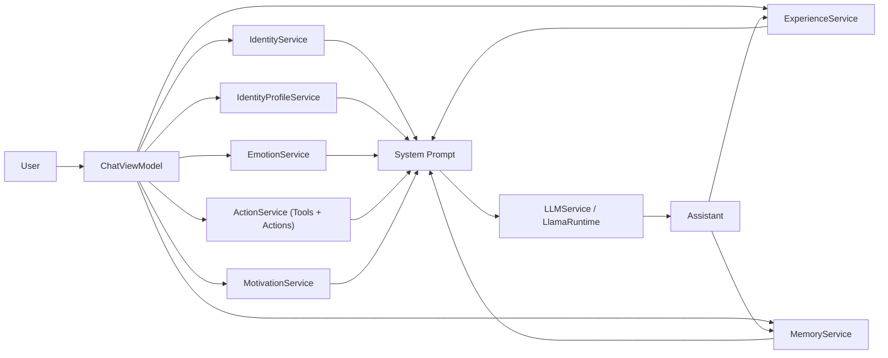

# VALIS

VALIS is an on-device AI chat app for iOS built with SwiftUI and `llama.cpp` (GGUF). It pairs local inference with a “plastic brain” memory system, experience-driven adaptation, lightweight tool use, and a glassy UI layer.

## Features

- **On-device inference**: Runs locally using GGUF models via `llama.cpp`.
- **Model switching in Settings**: Runtime selection between bundled/downloadable profiles (`LFM 2.5 1.2B` and `Qwen 3 1.7B`) with hot reload.
- **Plastic Brain**: Memories have emotion tags, importance, embeddings, associative links, and activation/decay.
  - Context ranking now uses a temporal U-shape signal (recently revisited memories and deep older memories are both prioritized).
  - Echo activation decay now uses power-law behavior (fast initial drop, long tail plateau).
  - Nodes with strong associative connectivity (>3 links) get a decay immunity multiplier.
  - Rest-phase consolidation runs during idle windows: highly similar memories are compressed into abstract “rest-consolidated” traces instead of relying only on pruning.
  - Prediction-error feedback explicitly increases memory salience on mismatch (wrong prediction -> higher retained importance).
  - Novelty-adaptive context gate now filters memory candidates before prompt injection (not only a display metric).
- **Thinking UI**: Streams model output and parses `<think>...</think>` to show a separate thinking panel.
- **Inline Artifacts**: Assistant can return `<artifact type="html">...</artifact>` blocks that render live in chat bubbles via `WKWebView`. And you can edit code in Artifact with updated preview.
- **Artifact continuity**: Latest generated HTML artifact is remembered and reused as a base when user asks to improve/patch it.
- **Tools (optional network)**:
  - Rule-based tool injection (Date, DuckDuckGo summaries, Reddit /r/news feed, URL content analysis for pasted links).
  - Model-initiated tools via `TOOL:` lines (app executes tools and re-runs generation with results).
- **Chat iteration controls**:
  - Edit already-sent user message from context menu, then regenerate assistant response from that turn.
  - Regenerate assistant response from message context menu (`arrow.clockwise`).
- **Autonomous memory consolidation** (optional network): when a memory becomes “charged”, background logic can fetch short Wikipedia/DuckDuckGo snippets and store them as memories.
- **Experience & preferences**: Records experiences and learns preference signals from like/dislike or reaction text.
- **Motivators**: Maintains a small dynamic state (curiosity/helpfulness/caution) used to guide tone.
- **Affect state (self-access)**: `EmotionService` keeps a slow-changing internal affect state injected into the system prompt (meant to be mentioned sparingly, only when relevant).
- **Speech**: Speech-to-text for input and TTS for reading assistant messages.
- **Siri Shortcut**: You can say “Ask VALIS …” and the prompt is sent directly into chat.
- **UI / Glass**:
  - Translucent Settings sheet (chat visible underneath).
  - Settings and Memories use a lightweight “liquid glass” distortion shader backdrop.
- **Privacy First**: All data and inference stay on your device.

## Architecture Overview

SwiftUI + MVVM with a small service layer:

- `ChatViewModel` is the orchestration layer:
  - builds system prompt blocks (identity + identity profile + affect + tools + experience lessons + motivators + detail level + optional “spice”),
  - streams generation and parses `<think>` tags,
  - delegates tool/action parsing and execution to `ActionService` and re-runs generation with results (bounded multi-step loop),
  - records experiences and updates memory.

- `ActionService` handles external actions/signals:
  - rule-based tool context injection (Date / Web / News / URL analysis),
  - model-initiated `TOOL:`/`ACTION:` parsing,
  - tool execution (`web_search`, `analyze_url`, `reddit_news`, `date`),
  - action execution (`open_url`, `calendar` open/create/list),
  - autonomous web/wiki enrichment used by spontaneous memory triggers.

- `LLMService` wraps `LlamaRuntime` and handles:
  - model loading,
  - streaming token generation,
  - cancellation,
  - short-term response cache,
  - extracting a cognitively-relevant sentence to store back into memory.

- `MemoryService` is the “plastic brain”:
  - stores `Memory` objects (emotion, embeddings, importance, prediction signals),
  - maintains `MemoryGraph` + `CognitiveEchoGraph`,
  - ranks recall/context with temporal U-shape weighting (recency + deep-age revival),
  - uses power-law activation decay in the echo graph (instead of plain exponential),
  - applies associative-link immunity to highly connected nodes during decay,
  - keeps an accumulated prediction-error signal and raises importance on mismatch,
  - runs idle “rest” consolidation that merges highly similar traces into compact abstractions,
  - uses a novelty-adaptive context gate to pre-filter low-activation/low-relevance memories before `getContextBlock()`,
  - applies slow identity-node decay with restoration-by-repetition (persistent, not frozen),
  - runs echo/spontaneous loops,
  - produces the `getContextBlock()` injected into the LLM prompt.

```mermaid
flowchart LR
  U["User"] --> CVM["ChatViewModel"]
  CVM --> ID["IdentityService"]
  CVM --> IDP["IdentityProfileService"]
  CVM --> AFF["EmotionService"]
  CVM --> ACT["ActionService (Tools + Actions)"]
  CVM --> EXP["ExperienceService"]
  CVM --> MOT["MotivationService"]
  CVM --> MEM["MemoryService"]
  ID --> SYS["System Prompt"]
  IDP --> SYS
  AFF --> SYS
  ACT --> SYS
  EXP --> SYS
  MOT --> SYS
  MEM --> SYS
  SYS --> LLM["LLMService / LlamaRuntime"]
  LLM --> OUT["Assistant"]
  OUT --> EXP
  OUT --> MEM
```

## Tools

### Rule-based tools
The app automatically injects tool context when the user prompt matches simple triggers:
- **Date**: for “today's date / какая сегодня дата”
- **Web search**: DuckDuckGo Instant Answer summaries for “search / найди / кто такой / что такое”
- **News**: Reddit `/r/news` JSON feed for “news / новости / что нового”
- **URL analysis**: If prompt contains `http(s)` links, app fetches page content and injects a compact summary.

### Model-initiated tools (`TOOL:`)
The model can request tools inside `<think>` like:
- `TOOL: date`
- `TOOL: web_search | query=...`
- `TOOL: analyze_url | url=https://example.com/article`
- `TOOL: reddit_news`
- `ACTION: open_url | url=https://...`
- `ACTION: calendar | op=open; date=2026-03-01T10:00:00Z`
- `ACTION: calendar | op=create; title=Meeting; start=2026-03-01 18:30; duration_min=45`
- `ACTION: calendar | op=list; days=3; limit=5`
- `ARTIFACT: <artifact type="html" title="Demo">...</artifact>` (inside assistant answer)

The parser is tolerant to variants like `TOOL: news`, `TOOL: reddit news`, and `TOOL: reddit_news(...)`.

The app executes the tool, injects results (or a tool error block), and re-runs generation. The loop is bounded to avoid infinite cycles.

## Requirements

- Xcode 15+ (iOS 17+ target)
- `Frameworks/llama.xcframework`
- A GGUF model available either:
  - bundled in the app (`ZephyrAI/Resources/Models/`), or
  - downloaded on first launch (see “Model Download” below).

## Local Models (GGUF)

This repo currently includes these bundled models under `ZephyrAI/Resources/Models/`:

- `Qwen3-1.7B-Q4_K_M.gguf` (default profile from `LLMModelStorage.defaultValue`)
- `LFM2.5-1.2B-Thinking-Q8_0.gguf`

Model selection is stored in `UserDefaults` (`llm.selectedModel`) and can be changed in Settings.
To change app default for first launch, update `defaultValue` in `ZephyrAI/Models/LLMModel.swift`.

## Quick Start

1. Ensure `Frameworks/llama.xcframework` exists.
2. Choose model strategy:
   - Bundle one/both models in `ZephyrAI/Resources/Models/`, or
   - Rely on first-run download URLs defined in `ZephyrAI/Models/LLMModel.swift`.
3. Build and run `ZephyrAI.xcodeproj` on device.

## Model Download

`LLMService` searches for the model in this order:

1. `Application Support/VALIS/` (download location)
2. App bundle (bundled models in `ZephyrAI/Resources/Models/`)
3. `Documents/` (manual drop-in)

If the model is missing and `modelDownloadURLString` is set, the app downloads the model and shows download progress via the UI status.

Current model download URLs in code point to:

- `unsloth/LFM2.5-1.2B-Thinking-GGUF` (`LFM2.5-1.2B-Thinking-Q8_0.gguf`)
- `unsloth/Qwen3-1.7B-GGUF` (`Qwen3-1.7B-Q4_K_M.gguf`)

## Troubleshooting

- **Model not found**: confirm the GGUF is included in Copy Bundle Resources, present in `Application Support/VALIS/`, or present in Documents.
- **Download doesn't start**: check that `modelDownloadURLString` is set and the device has network access.
- **`Decode failed with code 1`**: KV cache slot failure. The runtime clamps context to model `n_ctx_train`, limits batch size, trims prompts, and will split prompt decode batches. If it persists, try a smaller model or lower context.
- **No sound for TTS**: `SpeechService` configures `AVAudioSession` for spoken audio; if still silent, check device mute switch and audio route.
- **Shader build errors**: the glass distortion shader is `ZephyrAI/Resources/glassDistortion.metal` and must match the SwiftUI stitchable signature expected by `distortionEffect`.

## Repo Layout

See `structure.md` for a detailed file-by-file breakdown.

## License

[TBD]
