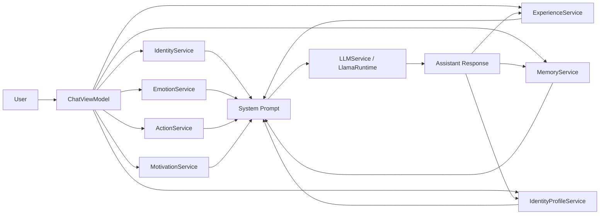

# VALIS Project Structure

Comprehensive repository layout and runtime architecture.

---

## Root Directory

| File/Folder | Description |
|-------------|-------------|
| `ZephyrAI/` | Main iOS app target (SwiftUI) |
| `ZephyrAILiveActivityExtension/` | Live Activity / Dynamic Island widget extension |
| `ZephyrAI.xcodeproj/` | Xcode project configuration |
| `ZephyrAITests/`, `ZephyrAIUITests/` | Unit and UI test targets |
| `Frameworks/` | Local binary frameworks |
| `README.md` | Project overview and benchmarks |
| `structure.md` | This file |
| `index.html` | Standalone benchmark visualization page |
| `IMG_*.png` | Screenshot assets |

### Ignored / Experimental Folders

These exist locally but are git-ignored:
- `AnyLanguageModel/`
- `mlx-swift/`
- `swift-llama-cpp/`

---

## App Source (`ZephyrAI/`)

### Entry Points

| File | Description |
|------|-------------|
| `ZephyrAIApp.swift` | SwiftUI app entry, Core Data persistence, Siri Shortcuts (`AskVALISIntent`) |
| `ContentView.swift` | Root navigation view |
| `Persistence.swift` | Core Data stack (`NSPersistentContainer`) |

### Models (`ZephyrAI/Models/`)

| File | Description |
|------|-------------|
| `Message.swift` | Chat message struct with `thinkContent`, `imageAttachment`, artifact metadata |
| `LLMModel.swift` | Model profile registry (`LFM 2.5 1.2B`, `Qwen3 1.7B`) + download URLs + persistence |
| `QuantumFeatures.swift` | Feature flags for quantum memory search and snippet parser |

### ViewModels (`ZephyrAI/ViewModels/`)

| File | Lines | Description |
|------|-------|-------------|
| `ChatViewModel.swift` | 3345 | Central orchestrator |

**ChatViewModel responsibilities:**
- System prompt assembly from 12 context blocks
- Streaming generation with `<think>...</think>` parsing
- Tool/action execution loop (`TOOL:`, `ACTION:`)
- Memory management and periodic self-reflection (every 8 turns)
- Multi-chat session persistence (`ChatSessionStore`)
- Artifact continuity per chat (remembered artifact for "improve/patch")
- Image attachment analysis via `VisionAttachmentService`
- Live Activity state updates (thinking/artifact/polishing)
- Motivator mutation cycle (jitter → evaluate → accept/revert)
- Response drift monitoring and repair

### Views (`ZephyrAI/Views/`)

| File | Lines | Description |
|------|-------|-------------|
| `ChatView.swift` | 2339 | Main chat UI with streaming, artifacts, MathJax, image attachments |
| `ArtifactView.swift` | ~90 | `WKWebView` wrapper for HTML artifacts with MathJax support |
| `SettingsView.swift` | ~400 | Translucent settings sheet with glass distortion shader backdrop |
| `MemoryListView.swift` | ~700 | Memory vault UI (pin, edit, delete, clear) |
| `IntroGreetingView.swift` | ~300 | Time-based greeting with procedural animation (day/night modes, device motion parallax) |

### Services (`ZephyrAI/Services/`)

#### Core Inference

| File | Lines | Description |
|------|-------|-------------|
| `LLMService.swift` | 907 | High-level LLM orchestration: model resolution, adaptive budgets, streaming, performance tracking |
| `LlamaRuntime.swift` | ~400 | Direct `llama.cpp` wrapper: model loading, token sampling, KV cache injection, decode failure recovery |
| `LanguageRoutingService.swift` | ~150 | Natural language detection with confidence scoring and reply language enforcement |
| `UserIdentityService.swift` | ~80 | User name/gender context injection with guardrails |

#### Memory System

| File | Lines | Description |
|------|-------|-------------|
| `MemoryService.swift` | 2547 | Plastic Brain: memory storage, embeddings, graph, echo activation, rest consolidation, prediction error |
| `QuantumMemoryService.swift` | ~300 | Grover-like amplitude amplification for diversity-biased memory selection |
| `MarkovMemoryLayer.swift` | ~150 | State transition prediction for context selection |
| `KVCacheInjector.swift` | ~100 | Prompt shaping helpers for KV cache injection |

#### Identity & Personality

| File | Lines | Description |
|------|-------|-------------|
| `IdentityService.swift` | ~70 | Master persona prompt storage and migration |
| `IdentityProfileService.swift` | ~250 | Living identity versioning with plasticity-based merging |
| `EmotionService.swift` | ~200 | Internal affect state (valence/intensity/stability) with decay |
| `MotivationService.swift` | ~400 | Agent dynamics: motivators, goals, reward, mutation cycle |
| `ResponseDriftService.swift` | ~250 | Quality monitoring: anchor retention, metaphor load, self-focus, repetition, echo detection |

#### Experience & Learning

| File | Lines | Description |
|------|-------|-------------|
| `ExperienceService.swift` | ~350 | Experience recording, preference learning, lessons injection |
| `CodeCoachService.swift` | ~150 | Coding quality guardrails (correctness, safe APIs, testability) |

#### Tools & Actions

| File | Lines | Description |
|------|-------|-------------|
| `ActionService.swift` | 1561 | Tool/action runtime: rule-based tools, model-initiated `TOOL:`/`ACTION:`, calendar, URL analysis, caching |
| `AutonomousMemorySources.swift` | ~100 | External snippet fetchers (DuckDuckGo, Wikipedia) |

#### Multimodal

| File | Lines | Description |
|------|-------|-------------|
| `VisionAttachmentService.swift` | ~400 | Image preprocessing: OCR, face detection/landmarks, object detection, similar image retrieval |
| `SpeechService.swift` | ~120 | Text-to-speech with locale-aware voice selection |

#### System

| File | Lines | Description |
|------|-------|-------------|
| `VALISLiveActivityService.swift` | ~150 | Live Activity / Dynamic Island state bridge |
| `Notifications.swift` | ~30 | `NotificationCenter` keys |
| `MarkdownRenderer.swift` | ~40 | Inline markdown rendering with caching |

### Resources (`ZephyrAI/Resources/`)

| Path | Description |
|------|-------------|
| `Models/` | Bundled GGUF models (git-ignored) |
| `Qwen3-1.7B-Q4_K_M.gguf` | Default model (Qwen3 1.7B, Q4_K_M quantization) |
| `LFM2.5-1.2B-Thinking-Q8_0.gguf` | Alternative model (LFM 2.5 1.2B, Q8_0 quantization) |
| `glassDistortion.metal` | Metal shader for liquid glass backdrop effect |

### Assets

| Path | Description |
|------|-------------|
| `Assets.xcassets/` | App icons, colors, symbols |

---

## Live Activity Extension (`ZephyrAILiveActivityExtension/`)

| File | Description |
|------|-------------|
| `VALISLiveActivityAttributes.swift` | Shared activity attributes and content state |
| `ZephyrAILiveActivityBundle.swift` | Widget bundle entry point and Dynamic Island UI |

---

## Architecture Deep Dive

### Memory Lifecycle

```
┌─────────────────────────────────────────────────────────────────┐
│                    Memory Ingestion                              │
│  User Turn → Assistant Turn → External (DDG/Wiki)                │
│                          ↓                                       │
│              buildCognitiveLayer                                 │
│              - Emotion detection                                 │
│              - Embedding (32-dim)                                │
│              - Link finding                                      │
│              - Importance scoring                                │
│                          ↓                                       │
│              Memory appended                                     │
│              - Save to disk                                      │
│              - Update graph                                      │
│              - Activate echo                                     │
└─────────────────────────────────────────────────────────────────┘
                          ↓
┌─────────────────────────────────────────────────────────────────┐
│                    Background Loops                              │
│  Echo Loop (~1s) │ Spontaneous Loop (~5s) │ Rest Consolidation  │
│  - Resonance     │ - Trigger memory       │ (idle, every 10min) │
│  - Decay         │ - Autonomous enrich    │ - Merge similar     │
│  - Spontaneous   │                        │ - Prune low-score   │
└─────────────────────────────────────────────────────────────────┘
                          ↓
┌─────────────────────────────────────────────────────────────────┐
│                    Context Retrieval                             │
│  getLLMContextBlock(maxChars, forUserText, candidateLimit)       │
│  1. Build query embedding from user text                         │
│  2. Score candidates: cosine × activation × temporal × importance│
│  3. Novelty-adaptive context gate (threshold: 0.28)              │
│  4. Build attention-weighted field over visible embeddings       │
│  5. Markov next-state prediction                                 │
│  6. Optional quantum collapse (diversity-biased)                 │
│  7. Reserve slots for pinned memories                            │
│  8. Format as bounded context block                              │
└─────────────────────────────────────────────────────────────────┘
```

### Echo Graph Mechanics

```swift
struct CognitiveEchoGraph {
    var activations: [UUID: Double]
    var persistentActivations: [UUID: Double]

    func resonanceStep()           // Reinforces linked memories
    func decay()                   // Power-law decay with immunity
    func spontaneousActivation()   // Random triggers
    func spontaneousStep() -> UUID? // Returns triggered memory ID
}
```

**Power-law decay formula:**
```
activation(t) = activation(0) / (1 + t/τ)^α
```

Nodes with >3 associative links receive immunity multiplier.

### LLM Inference Pipeline

```
┌─────────────────────────────────────────────────────────────────┐
│                    Prompt Assembly                               │
│  System Prompt Components (in order):                            │
│  1. Identity (master persona + tools)                            │
│  2. Identity Profile (3-word state)                              │
│  3. Emotion State                                                │
│  4. Tool Guidance                                                │
│  5. Experience Lessons                                           │
│  6. Preferences                                                  │
│  7. Motivator State + goals + reward                             │
│  8. Trajectory Guidance                                          │
│  9. Code Coach (if coding)                                       │
│  10. Drift Monitor                                               │
│  11. Memory Context (attention-weighted)                         │
│  12. Language Anchor                                             │
│  13. User Identity                                               │
│  14. Assistant Identity (name=VALIS guardrail)                   │
│                                                                  │
│  Hidden Prefix (KV injection):                                   │
│  - Projects memory field vector into KV cache                    │
│  - Beta weight (0.03) controls influence                         │
└─────────────────────────────────────────────────────────────────┘
                          ↓
┌─────────────────────────────────────────────────────────────────┐
│                    Adaptive Budgeting                            │
│  inferenceBudget(forPromptLength) computes:                      │
│  - contextLimit: 6144-24576 tokens                               │
│  - memoryBudgetRatio: 0.14-0.28                                  │
│  - memoryCandidateLimit: 2-4 memories                            │
│  - dialogTurns: 4-8 turns                                        │
│  - maxTokensCap: 640-6144 tokens                                 │
│                                                                  │
│  Factors: device tier, thermal state, memory pressure, latency   │
└─────────────────────────────────────────────────────────────────┘
                          ↓
┌─────────────────────────────────────────────────────────────────┐
│                    Llama.cpp Generation                          │
│  1. Tokenize prompt (llama_tokenize)                             │
│  2. Clamp to maxPromptChars                                      │
│  3. Decode prompt tokens in batches (llama_decode)               │
│  4. Apply KV injection (projected field vector)                  │
│  5. Sample tokens: temp → top-k → top-p → repeat penalty         │
│  6. Decode generated tokens                                      │
│  7. Stream UTF-8 pieces                                          │
│  8. Stop on EOS or maxTokens                                     │
│                                                                  │
│  Performance tracking: first-token latency, tokens/sec           │
└─────────────────────────────────────────────────────────────────┘
                          ↓
┌─────────────────────────────────────────────────────────────────┐
│                    Post-Processing                               │
│  1. Parse thinking tags                                          │
│  2. Parse tool/action calls                                      │
│  3. Parse artifacts                                              │
│  4. Check for drift                                              │
│  5. Record experience                                            │
│  6. Update memory                                                │
│  7. Update motivators                                            │
│  8. Update identity profile                                      │
│  9. Self-reflection (every 8 turns)                              │
│  10. Update Live Activity                                        │
└─────────────────────────────────────────────────────────────────┘
```

---

## Key Architectural Insights

1. **Memory compensates for model scale**: 1.7B parameters + Plastic Brain = GPT-level philosophical reasoning

2. **Living identity**: Identity evolves through user reactions with valence-modulated plasticity

3. **Motivator-driven behavior**: Explicit goals (understand, uncertainty, evolution) with periodic personality mutation

4. **Drift monitoring**: Continuous quality tracking with automatic repair when drift exceeds threshold

5. **Adaptive inference**: Dynamic context/memory/output budgets based on device conditions

6. **Quantum-inspired retrieval**: Grover-like amplitude amplification for diverse memory selection

7. **Separate chats, shared memory**: Independent message history with unified long-term memory

8. **Artifact continuity**: Per-chat artifact memory enables iterative improvement workflows

---

## Data Flow Diagram


